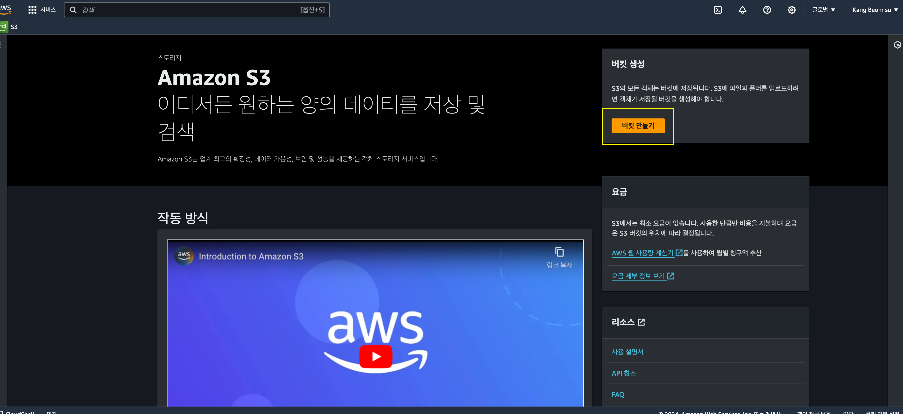

# Setting

우선 본 내용은 회원 가입을 한 후 s3시작부터 적어 본다.


aws 회원 가입은 신용카드가 필요하다.

처음 가입이라면 1년동안 프리티어 기준 무료로 사용 가능.


### S3 페이지 접속후 버킷 만들기를 클릭한다.

<figure><figcaption></figcaption></figure>

### AWS 리전을 선택한다.&#x20;


aws 리전은 현재 내가 위치한 국가에서 가까운곳이 좋다. (속도향상)

대한민국을 기준으로 아시아 태평양(서울)을 선택하자.


### 버킷 이름 설정.

버킷 이름을 설정한다. 본인이 편한 이름을 설정하면 된다.&#x20;


단, 이름이 이미 존재한다면 다른 이름을 사용해야한다.


<figure><figcaption></figcaption></figure>

버킷 이름을 설정했다면 나머지 내용은 일단 default로 설정하고 가장 아래 버킷 만들기를 클릭한다.

나머지 내용은 이후 설명.

버킷을 생성하면 아래와같이 버킷이 생성된 것을 확인할 수 있다.

<figure><figcaption></figcaption></figure>

만든 버킷이름을 클릭하면 아래와 같이 파일을 업로드할 수 있다.

<figure><figcaption></figcaption></figure>

업로드를 클릭후 다른 어느곳에서 파일을 업로드 하듯이 사용하면 된다.


버킷 생성 당시 default 설정으로 생성하여서, 파일을 외부 공유는 불가능하다.

다음페이지에서 퍼블릭으로 변경하는 방법을 알아보자.


